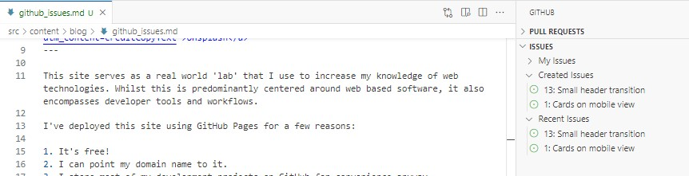

This site serves as a real world 'lab' that I use to increase my knowledge of web technologies. Whilst this is predominantly centered around web based software, it also encompasses developer tools and workflows.

I've deployed this site using GitHub Pages for a few reasons:

1. It's free!
2. I can point my domain name to it.
3. I store most of my development projects on GitHub for convenience anyway.
4. It can auto build and deploy when I update the source.
5. I wanted to get more comfortable with the whole process.

So I already had all this setup, I commit and push changes and GitHub Actions take care of building and deploying. What's even better is I can do all this from within VSCode! Simples.

Up until now, I had a rough to do list, but mostly I'd just open up the code and tweak, modify something, fix bugs, repeat. I've found this regularly leads down rabbit holes and the result is wasted time and half the site updated each commit.

In an attempt to neaten up my process, I tried GitHub Issues for enhancements I wanted to make, or bugs I found. Basically just using it as a glorified to do list.

This was good by itself, but to get a better understanding of the developer workflow I did it the way I imaging the big kids do:

1. Open an issue
2. Create a branch for the issue
3. Fix the issue
4. Test the fix
5. Commit the changes
6. Submit a pull request
7. Merge changes

It sounds complicated, but it really isn't, and with the right extensions installed, can easily all be managed from VSCode. I actually discovered a small bug with another area while testing a fix, without leaving VSCode, I quickly added a new Issue so I could focus on the current item and deal with it later.

The end result is all win; my 'somewhere on the spectrum' brain can work effectively, I increased my knowledge and the result is improved.
