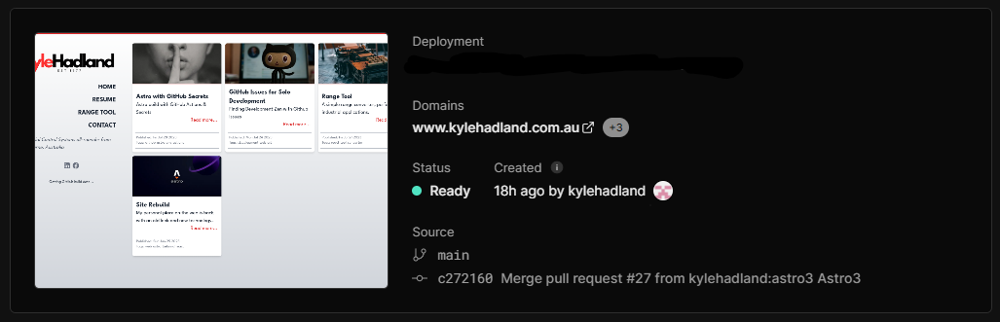
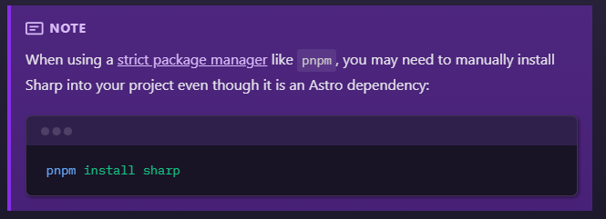

Just a small update more for the sake of development than any critical need.

Astro announced some important updates late August 2023:

- [Vercel: Our Official Hosting Partner | Astro](https://astro.build/blog/vercel-official-hosting-partner/)
- [Astro 3.0 | Astro](https://astro.build/blog/astro-3/)

## Vercel

Firstly the simple building and hosting with [Vercel](https://vercel.com) was of interest as an upgrade from the GitHub Pages which I had been using. GitHub worked fine once originally setup, however it lacked the ability to preview builds prior to updating the main site. With such a low traffic site this isn't a requirement but would make my workflow a bit neater.

Vercel made this process trivially simple! Create a free account, point it to my GitHub repository and it detected the Astro source and built away. The interface then guided me to update my domain name DNS settings and we were done.



## Astro 3.0

Astro 3.0 doesn't explicitly bring any new functionality that I have not already utilised, but does move some functions from 'experimental' to 'stable'. Image Optimisation and View Transitions are two such functions which I have utilised with great success.

Upgrading was somewhat simple with a couple of small bugs with easy fixes. The upgrade itself went ok, I upgraded Astro with `npm install astro@latest`, then React and Tailwind with `npm install @astrojs/react@latest @astrojs/tailwind@latest`.

Quickly modified the astro.config file by removing the now unnecessary experimental section:

```jsx
import { defineConfig } from "astro/config"

export default defineConfig({
  experimental: {
    assets: true,
    viewTransitions: true,
  },
})
```

Fired it up in a dev environment and all was wonderful. Pushed the branch to GitHub and a new preview build was triggered in Vercel, and failed. The issue was with Sharp processing of images, a quick check of the docs and a solution was presented.....



I initiated a build on my dev system to verify and another failure, the version of node.js on my laptop was too old. Easy fix and success.

After some testing in the Vercel preview build all looked good, created a pull request, deployed to main and we are off to the races!
