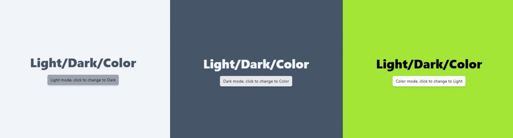

Light and Dark modes are almost a necessity with current UI designs. Operating systems have it built in, web sites can even piggy back on this and automatically select the users system preference.

As we all know however, life is not black and white (or light and dark). I had an idea, I wanted to build something with a bold bright coloured background, but have the option to tone it down to suit the viewers preferences. I also wanted to make it simple to implement in any element, just like Tailwindcss dark mode functionality.

This is my answer.....

## Demo

Demo is available here [Light Dark Color](https://ldc.kylehadland.com.au).

## References

Apart from the Astro and Tailwindcss docs I also took some guidance from an article by Kevin Zuniga Cuellar:

- [Add dark mode to Astro with Tailwind CSS (kevinzunigacuellar.com)](https://www.kevinzunigacuellar.com/blog/dark-mode-in-astro/)
- [Dark Mode - Tailwind CSS](https://tailwindcss.com/docs/dark-mode)
- [Plugins - Tailwind CSS](https://tailwindcss.com/docs/plugins#adding-variants)
- [@astrojs/preact 🚀 Astro Documentation](https://docs.astro.build/en/guides/integrations-guide/preact/)

## Goal

The following were the design objectives:

- Utilise the standard light / dark mode selection
- Honor the system preferred scheme if nothing has been chosen
- Add a new color mode to the light / dark options
- Remember the last used setting for future visits
- Use the tailwind variant modifiers if possible, eg `text-black dark:text-white color:text-green`

## Setup

To develop the concept I first setup a new blank Astro.build installation on my local machine, you can follow the guide here: [Getting Started 🚀 Astro Documentation](https://docs.astro.build/en/getting-started/). I added Tailwindcss and Preact at the same time to handle styling and the mode switching functionality. Note that I use PNPM as its fully supported by Astro and is quick and easy but you can also use NPM or YARN.

> I recommend selecting the Empty template option during the Astro create script as you don't need the sample or blog template files.

```sh
pnpm create astro@latest
pnpm astro add tailwind
pnpm astro add preact
```

## Mode Selection

I took the code from [Add dark mode to Astro with Tailwind CSS (kevinzunigacuellar.com)](https://www.kevinzunigacuellar.com/blog/dark-mode-in-astro/) and made changes to add a third option. I recommend checking out Kevin's article then seeing what I've changed.

I just added this to the bottom default index.astro file:

```jsx
<script is:inline>
const theme = (() => {
    if (typeof localStorage !== "undefined" && localStorage.getItem("theme")) {
        return localStorage.getItem("theme")
    }
    if (window.matchMedia("(prefers-color-scheme: dark)").matches) {
        return "dark"
    }
    return "light"
})()

switch (theme) {
    case "dark":
        document.documentElement.classList.remove("color")
        document.documentElement.classList.add("dark")
        break
    case "color":
        document.documentElement.classList.add("color")
        document.documentElement.classList.remove("dark")
        break
    default:
        document.documentElement.classList.remove("dark")
        document.documentElement.classList.remove("color")
}

window.localStorage.setItem("theme", theme)
</script>
```

I then created the UI for toggling the mode manually, here I used Preact as its a bit lighter than React but the code should be identical. This is separate component file that we will import into index.astro after.

```jsx
import { useEffect, useState } from "preact/hooks"

export default function ThemeToggle() {
  const [theme, setTheme] = useState(localStorage.getItem("theme") ?? "light")

  const handleClick = () => {
    switch (theme) {
      case "light":
        setTheme("dark")
        break
      case "dark":
        setTheme("color")
        break
      default:
        setTheme("light")
    }
  }

  useEffect(() => {
    switch (theme) {
      case "dark":
        document.documentElement.classList.remove("color")
        document.documentElement.classList.add("dark")
        break
      case "color":
        document.documentElement.classList.add("color")
        document.documentElement.classList.remove("dark")
        break
      default:
        document.documentElement.classList.remove("dark")
        document.documentElement.classList.remove("color")
    }
    localStorage.setItem("theme", theme)
  }, [theme])

  const ThemeButton = () => {
    switch (theme) {
      case "light":
        return "Dark"
      case "dark":
        return "Color"
      default:
        return "Light"
    }
  }
  return (
    <button
      onClick={handleClick}
      className='py-2 px-3  dark:bg-gray-200 color:bg-gray-50 bg-gray-400 text-black rounded-md shadow-md'
    >
      <span className='capitalize'>{theme}</span> mode, click to change to{" "}
      {ThemeButton()}
    </button>
  )
}
```

## Tailwind Config

You can read about how Tailwind implements dark mode here: [Dark Mode - Tailwind CSS](https://tailwindcss.com/docs/dark-mode)

To toggle the mode you simple add the class `dark` to the root (`<html>`) element. The `dark:` variant will then be utilised throughout your styling. To meet my goals, I wanted to have a `color` class in the root element and add a `color:` variant in my classes to implement the color styles.

This can be done surprisingly simple in the `tailwind.config.cjs` file:

```js
/** @type {import('tailwindcss').Config} */
const plugin = require("tailwindcss/plugin")

module.exports = {
  content: ["./src/**/*.{astro,html,js,jsx,md,mdx,svelte,ts,tsx,vue}"],
  darkMode: "class",
  theme: {
    extend: {},
  },
  plugins: [
    plugin(function ({ addVariant }) {
      addVariant("color", ':root[class~="color"] &')
    }),
  ],
}
```

To enable the standard dark mode functionality add the `darkMode: "class"` option.

To add a new variant based on the addition of a color class to the root object, add the `tailwindcss/plugin` import then the `addVariant`section under plugins. This activates the `color` variant when the root element has a class of `color`.

> Make sure you include the ampersand (&) in the selector or it won't work.

## Put it together

To put this to the test I ended up with the following changes to the base index.astro file. In a real application this would likely be split into a layout file and a header component etc.

```jsx
<body class='bg-slate-100 dark:bg-slate-600 color:bg-lime-400 text-slate-600 dark:text-slate-100 color:text-black'>
  <div class='h-screen flex flex-col items-center justify-center'>
    <h1 class='text-5xl font-black m-6'>Light/Dark/Color</h1>
    <ThemeToggle client:only='preact' />
  </div>
</body>
```

The classes added to the body specify the colours to use globally depending on the selected mode.

The ThemeToggle is the component we created earlier to handle the toggling, the client:only directive is specific to Astro to make this function only on the client side.

The end result should be three different color schemes, easily toggled by pressing the button. The selected scheme should be remembered during a refresh or revisit.



## Source files

I've included the complete source files for reference:

### /src/index.astro

```jsx
---
import ThemeToggle from "../components/ThemeToggle"
---

<html lang='en'>
  <head>
    <meta charset='utf-8' />
    <link rel='icon' type='image/svg+xml' href='/favicon.svg' />
    <meta name='viewport' content='width=device-width' />
    <meta name='generator' content={Astro.generator} />
    <title>Astro</title>
  </head>
  <body
    class='bg-slate-100 dark:bg-slate-600 color:bg-lime-400 text-slate-600 dark:text-slate-100 color:text-black'
  >
    <div class='h-screen flex flex-col items-center justify-center'>
      <h1 class='text-5xl font-black m-6'>Light/Dark/Color</h1>
      <ThemeToggle client:only='preact' />
    </div>
  </body>
</html>

<script is:inline>
const theme = (() => {
	if (typeof localStorage !== "undefined" && localStorage.getItem("theme")) {
		return localStorage.getItem("theme")
	}
	if (window.matchMedia("(prefers-color-scheme: dark)").matches) {
		return "dark"
	}
	return "light"
})()

switch (theme) {
	case "dark":
		document.documentElement.classList.remove("color")
		document.documentElement.classList.add("dark")
		break
	case "color":
		document.documentElement.classList.add("color")
		document.documentElement.classList.remove("dark")
		break
	default:
		document.documentElement.classList.remove("dark")
		document.documentElement.classList.remove("color")
}

window.localStorage.setItem("theme", theme)
</script>
```

### /tailwind.config.cjs

```js
/** @type {import('tailwindcss').Config} */
const plugin = require("tailwindcss/plugin")

module.exports = {
  content: ["./src/**/*.{astro,html,js,jsx,md,mdx,svelte,ts,tsx,vue}"],
  darkMode: "class",
  theme: {
    extend: {},
  },
  plugins: [
    plugin(function ({ addVariant }) {
      addVariant("color", ':root[class~="color"] &')
    }),
  ],
}
```

### /astro.config.mjs

```js
import { defineConfig } from "astro/config"
import tailwind from "@astrojs/tailwind"
import preact from "@astrojs/preact"

// https://astro.build/config
export default defineConfig({
  integrations: [tailwind(), preact()],
})
```

### /src/components/ThemeToggle.jsx

```jsx
import { useEffect, useState } from "preact/hooks"

export default function ThemeToggle() {
  const [theme, setTheme] = useState(localStorage.getItem("theme") ?? "light")

  const handleClick = () => {
    switch (theme) {
      case "light":
        setTheme("dark")
        break
      case "dark":
        setTheme("color")
        break
      default:
        setTheme("light")
    }
  }

  useEffect(() => {
    switch (theme) {
      case "dark":
        document.documentElement.classList.remove("color")
        document.documentElement.classList.add("dark")
        break
      case "color":
        document.documentElement.classList.add("color")
        document.documentElement.classList.remove("dark")
        break
      default:
        document.documentElement.classList.remove("dark")
        document.documentElement.classList.remove("color")
    }
    localStorage.setItem("theme", theme)
  }, [theme])

  const ThemeButton = () => {
    switch (theme) {
      case "light":
        return "Dark"
      case "dark":
        return "Color"
      default:
        return "Light"
    }
  }
  return (
    <button
      onClick={handleClick}
      className='py-2 px-3  dark:bg-gray-200 color:bg-gray-50 bg-gray-400 text-black rounded-md shadow-md'
    >
      <span className='capitalize'>{theme}</span> mode, click to change to{" "}
      {ThemeButton()}
    </button>
  )
}
```
