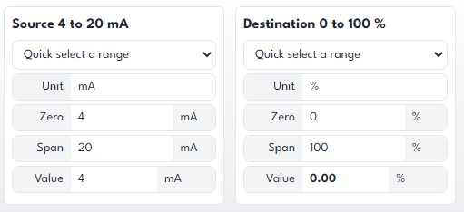

Quite often I find myself needing to convert a value from one range of units to another. In many cases this is a simple calculation however when the ranges are between odd values it can get a little more complicated.

I had a simple little spreadsheet to plug numbers in and get the conversion, however it would be handy to have this in my pocket when out in the field commissioning some instruments.

So I build a simple tool:

### How to Use

**Source**
Set the source zero, span, units and value in the source box. Start with an item in the select box to get you started and adjust to suit. For example, if you are looking at a current loop you may input 4-20 mA as the zero, span and unit, then set the value to the mA you are reading.

**Destination**
Repeat the above for the destination units. You won't be able to put a value in as this is calculated for you.

**Additional Destinations**
Sometimes you may need to do multiple conversions on the same source value. I've done this before when scaling a value in a PLC and wanting to verify the source vs raw vs scaled values. Just press the Add another button and repeat.

### Limitations

- Only a few starter items have been added to the select.
- Refresh the page and your changes will be lost, I'll add some session storage when time permits.

### Tech notes

This functionality was added using React within Astro. Sounds complicated, really isn't and is a credit to the team at Astro, check it out here [Astro Framework Components](https://docs.astro.build/en/core-concepts/framework-components/).
