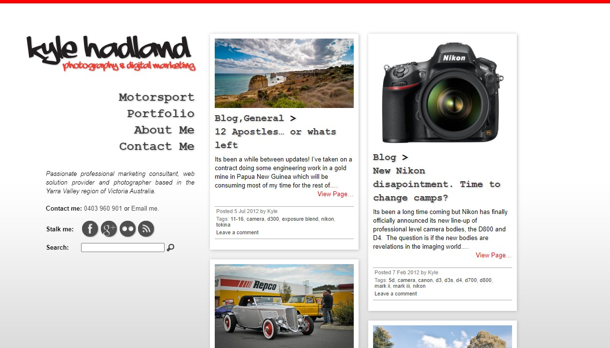

My personal place on the web is back, with an old look and new technology. Read on for details of the how, what and why.

## Why

Whilst I'm no longer running a business that benefits greatly from an online presence, I've held on to my domain name and hosting is effectively free these days so I keep a presence for the following reasons:

1. Resume - My current resume can be online for if potential employers search for my name directly.
2. Development - Enables me to evaluate new tools and technologies with a real project that can be deployed.
3. Showcase - Its a live demonstration of my abilities in this space.

## Styling

### History

Many years ago now I was taking a break from the industrial automation world and having some fun doing photography, marketing and web design. This was around the time of Wordpress being the predominant platform and I spent a lot of my time designing in Photoshop, slicing and dicing and building custom templates.

When I started doing more freelance in between staff jobs I built myself a website using the familiar Wordpress with a custom template. As I recall I wanted a unique site, that was polished and worked well for highlighting the photography work I was doing.

I spent many hours (too many hours) pixel perfecting and the end result was almost perfectly what I was looking for.

The site stayed live for many years, even after I had stopped freelancing until eventually the company I had it hosted with disappeared and with it the only copy I had.

### Current

I have had other iterations of the site since the original was lost, however I came across a 'time-machine' instance of the original design and thought it would be interesting to replicate the design using modern tools.

I spent a few hours and created a dummy replica of the site offline using a Next.js installation with Tailwind.css. It looked similar but used responsive styles to display very well on mobile devices and large screens.

## Framework

With the design inspiring me I needed a real platform to bring it to life. This is a good opportunity to evaluate some of the latest frameworks with a real, albeit not important, example.

I won't go into excessive detail here about my requirements and evaluation process, that may be another post, but I landed on Astro.build. Its very 'React' based, handles Markdown content and was elegant in its setup.

A quick development install and some refactoring of the design code and here's what we have!
